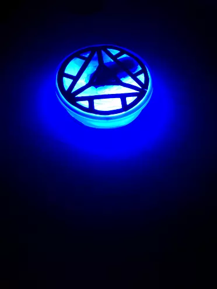
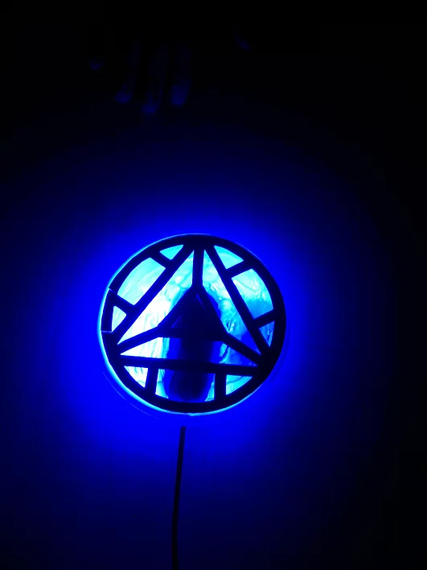

# Smart Arc Reactor

 

Smart Arc Reactor is an innovative solution to locating what was once lost. Be it your expensive headphone set or possession that your grandmother gifted you, we've got your back. Based on the simple principle of Computer Vision, our product identifies what is yours and holds within its memory the location it was last seen at. It consists of a webcam that captures your whereabouts, stores the data collected and identifies the object that belongs to you.

Object identification has been programmed using the Tenserflow object detection API on Python, using pretrained weights. With high-fidelity, our prototype recognizes objects with razor-sharp detail.

We have also created a custom script that identifies only the objects we are looking for. Another script takes in the query sent by our app and displays the location along with the time stamp of the item the user is searching for.

Taking inspiration from the Marvel series, our design is a recreation of the iconic "Jarvis" in iron man, as we put together a work of art and cutting edge design with maximum functionality. The design is made lightweight, comfortable and aesthetically pleasing with the help of high-grade materials while integrating the perfect balance between bling and minimalism.
 ## Prototype
 

## Demo

For more detailes you may refer to https://satvikaethakota.wixsite.com/mysite
